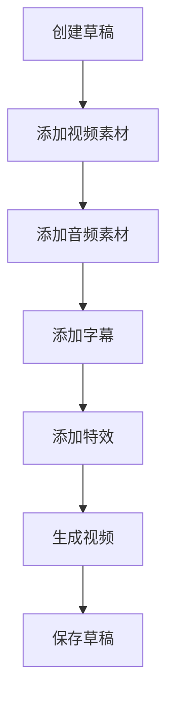
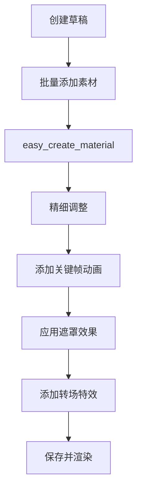

# CapCut Mate API 文档

## 📖 项目简介

CapCut Mate API 是一个基于 FastAPI 构建的剪映小助手，为开发者提供强大的视频编辑自动化能力。通过 RESTful API 接口，您可以轻松创建、编辑和渲染视频内容，无需手动操作剪映软件。

> **🔗 项目地址**: [GitHub](https://github.com/Hommy-master/capcut-mate) | [Gitee](https://gitee.com/taohongmin-gitee/capcut-mate)

## 📑 目录

- [📖 项目简介](#-项目简介)
- [✨ 核心功能](#-核心功能)
- [🚀 快速开始](#-快速开始)
- [📚 API 接口文档](#-api-接口文档)
- [🏗️ 系统架构](#️-系统架构)
- [🔄 典型工作流程](#-典型工作流程)
- [📊 API 使用统计](#-api-使用统计)
- [⚡ 性能优化](#-性能优化)
- [🔧 更多文档](#-更多文档)
- [💬 技术支持](#-技术支持)
- [📄 许可证](#-许可证)

## ✨ 核心功能

### 🎬 视频制作流程

- **草稿管理**：创建、保存、获取草稿信息
- **素材添加**：支持视频、音频、图片、贴纸等多种素材
- **文本处理**：添加字幕、文本样式、关键词高亮
- **特效应用**：视觉特效、动画、转场、遮罩效果
- **视频渲染**：云端生成最终视频文件

### 🔧 技术特性

- **高性能**：基于 FastAPI 构建，支持异步处理
- **类型安全**：使用 Pydantic 进行数据验证
- **标准化**：符合 RESTful API 设计规范
- **自动文档**：集成 Swagger UI 交互式文档
- **容器化**：支持 Docker 部署

## 🚀 快速开始

### 环境准备

在开始使用 CapCut Mate API 之前，请确保您具备以下条件：

- 🌐 **网络环境**: 能够访问 API 服务地址
- 🔑 **API 权限**: 已获得相应的 API 访问权限
- 📚 **开发环境**: 支持 HTTP 请求的开发环境

### 📋 API 调用流程

CapCut Mate API 的典型使用流程如下：



### 💻 快速示例

#### Python 示例

```python
import requests
import json

# 1. 创建草稿
def create_draft():
    url = "https://capcut-mate.jcaigc.cn/openapi/capcut-mate/v1/create_draft"
    payload = {
        "aspect_ratio": 1,  # 16:9 横屏
        "duration": 60000000  # 60秒
    }
    
    response = requests.post(url, json=payload)
    return response.json()

# 2. 添加视频
result = create_draft()
draft_url = result["data"]["draft_url"]

# 继续添加其他素材...
print(f"草稿创建成功: {draft_url}")
```

#### JavaScript 示例

```javascript
// 创建草稿
async function createDraft() {
  const response = await fetch('https://capcut-mate.jcaigc.cn/openapi/capcut-mate/v1/create_draft', {
    method: 'POST',
    headers: { 'Content-Type': 'application/json' },
    body: JSON.stringify({
      aspect_ratio: 1,
      duration: 60000000
    })
  });
  
  const result = await response.json();
  return result.data.draft_url;
}

// 使用示例
createDraft().then(draftUrl => {
  console.log('草稿创建成功:', draftUrl);
  // 继续添加其他素材...
});
```

## 📚 API 接口文档

CapCut Mate API 提供以下核心接口，支持完整的视频创作工作流程：

### 🏗️ 草稿管理

| 接口 | 功能 | 描述 | 文档链接 |
|------|------|------|----------|
| **create_draft** | 创建草稿 | 创建新的剪映草稿项目，设置画布尺寸 | [📖 查看文档](./create_draft.md) |
| **save_draft** | 保存草稿 | 保存当前草稿状态，确保编辑内容持久化 | [📖 查看文档](./save_draft.md) |
| **get_draft** | 获取草稿 | 获取草稿文件列表和详细信息 | [📖 查看文档](./get_draft.md) |

### 🎥 视频素材

| 接口 | 功能 | 描述 | 文档链接 |
|------|------|------|----------|
| **add_videos** | 添加视频 | 批量添加视频素材，支持裁剪、缩放、特效 | [📖 查看文档](./add_videos.md) |
| **add_images** | 添加图片 | 批量添加图片素材，支持动画和转场效果 | [📖 查看文档](./add_images.md) |
| **add_sticker** | 添加贴纸 | 添加装饰贴纸，支持位置和大小调整 | [📖 查看文档](./add_sticker.md) |

### 🎵 音频处理

| 接口 | 功能 | 描述 | 文档链接 |
|------|------|------|----------|
| **add_audios** | 添加音频 | 批量添加音频素材，支持音量和淡入淡出 | [📖 查看文档](./add_audios.md) |
| **get_audio_duration** | 获取音频时长 | 获取音频文件的精确时长信息 | [📖 查看文档](./get_audio_duration.md) |

### 📝 文本字幕

| 接口 | 功能 | 描述 | 文档链接 |
|------|------|------|----------|
| **add_captions** | 添加字幕 | 批量添加字幕，支持关键词高亮和样式设置 | [📖 查看文档](./add_captions.md) |
| **add_text_style** | 文本样式 | 创建富文本样式，支持关键词颜色和字体 | [📖 查看文档](./add_text_style.md) |

### ✨ 特效动画

| 接口 | 功能 | 描述 | 文档链接 |
|------|------|------|----------|
| **add_effects** | 添加特效 | 添加视觉特效，如滤镜、边框、动态效果 | [📖 查看文档](./add_effects.md) |
| **add_keyframes** | 关键帧动画 | 创建位置、缩放、旋转等属性动画 | [📖 查看文档](./add_keyframes.md) |
| **add_masks** | 遮罩效果 | 添加各种形状遮罩，控制画面可见区域 | [📖 查看文档](./add_masks.md) |

### 🎨 动画资源

| 接口 | 功能 | 描述 | 文档链接 |
|------|------|------|----------|
| **get_text_animations** | 文本动画 | 获取可用的文本入场、出场、循环动画 | [📖 查看文档](./get_text_animations.md) |
| **get_image_animations** | 图片动画 | 获取可用的图片动画效果列表 | [📖 查看文档](./get_image_animations.md) |

### 🎬 视频生成

| 接口 | 功能 | 描述 | 文档链接 |
|------|------|------|----------|
| **gen_video** | 生成视频 | 提交视频渲染任务，异步处理 | [📖 查看文档](./gen_video.md) |
| **gen_video_status** | 查询状态 | 查询视频生成任务的进度和状态 | [📖 查看文档](./gen_video_status.md) |

### 🚀 快速工具

| 接口 | 功能 | 描述 | 文档链接 |
|------|------|------|----------|
| **easy_create_material** | 快速创建 | 一次性添加多种类型素材，简化创建流程 | [📖 查看文档](./easy_create_material.md) |

### 🔗 快速导航

<div align="center">

**🎯 新手入门**: [创建草稿](./create_draft.md) → [添加视频](./add_videos.md) → [生成视频](./gen_video.md)

**🎨 进阶创作**: [添加字幕](./add_captions.md) → [添加特效](./add_effects.md) → [添加音频](./add_audios.md)

**💾 项目管理**: [保存草稿](./save_draft.md) → [查看草稿](./get_draft.md)

</div>

## 🏗️ 系统架构

### 分层设计

```
┌─────────────────┐
│   FastAPI App   │  HTTP API 层
├─────────────────┤
│   Middlewares   │  中间件层（请求预处理、响应格式化）
├─────────────────┤
│   Router (v1)   │  路由层（接口定义、参数验证）
├─────────────────┤
│   Service       │  业务逻辑层（核心功能实现）
├─────────────────┤
│ pyJianYingDraft │  剪映草稿处理层（草稿文件操作）
├─────────────────┤
│     Utils       │  工具层（缓存、日志、任务管理）
└─────────────────┘
```

### 核心模块

- **Router**: API 路由定义和请求处理
- **Service**: 业务逻辑实现和数据处理
- **pyJianYingDraft**: 剪映草稿文件的创建和编辑
- **Schemas**: 数据模型定义和验证
- **Utils**: 缓存管理、日志记录、任务调度

## 🔄 典型工作流程

### 基础视频制作流程


### 进阶制作流程



## 📊 API 使用统计

### 接口分类

- **草稿管理**: 3 个接口
- **素材添加**: 6 个接口  
- **特效动画**: 5 个接口
- **视频生成**: 2 个接口
- **辅助工具**: 2 个接口

### 常用组合

1. **快速制作**: `create_draft` → `easy_create_material` → `gen_video`
2. **精细编辑**: `create_draft` → `add_videos` → `add_audios` → `add_captions` → `add_effects` → `gen_video`
3. **动画制作**: `create_draft` → `add_images` → `add_keyframes` → `add_masks` → `gen_video`

## ⚡ 性能优化

### 建议实践

- **批量操作**: 尽量使用批量接口减少请求次数
- **异步处理**: 视频生成使用异步任务，避免长时间等待
- **缓存机制**: 草稿信息支持缓存，提高访问速度
- **错误重试**: 网络请求失败时自动重试
- **资源预检**: 使用 `get_audio_duration` 等接口预检资源

### 限制说明

- **并发限制**: 避免同时处理过多视频生成任务
- **文件大小**: 建议单个素材文件不超过 100MB
- **时长限制**: 建议单个视频时长不超过 10 分钟
- **请求频率**: 建议控制请求频率，避免服务器过载

## 🔧 更多文档

📖 更多详细文档和教程请访问：[https://docs.jcaigc.cn](https://docs.jcaigc.cn)

## 💬 技术支持

### 获取帮助

- **📖 交互式文档**: 访问 `http://localhost:60000/docs` 查看 Swagger UI
- **🐛 问题反馈**: 提交 [GitHub Issues](https://github.com/Hommy-master/capcut-mate/issues) 或 [Gitee Issues](https://gitee.com/taohongmin-gitee/capcut-mate/issues)
- **📧 商业合作**: 联系邮箱 `taohongmin51@gmail.com`
- **💬 社区讨论**: 欢迎提交 Pull Request 来改进项目

### 贡献指南

欢迎提交 Pull Request 来改进项目：

1. 🍴 Fork 项目
2. 🌿 创建功能分支
3. 📝 提交更改
4. 🚀 创建 Pull Request

### 开源地址

<div align="center">

[](https://github.com/Hommy-master/capcut-mate)
[](https://gitee.com/taohongmin-gitee/capcut-mate)

**GitHub**: [https://github.com/Hommy-master/capcut-mate](https://github.com/Hommy-master/capcut-mate)  
**Gitee**: [https://gitee.com/taohongmin-gitee/capcut-mate](https://gitee.com/taohongmin-gitee/capcut-mate)

</div>

---

<div align="right">

📚 **项目资源**  
**GitHub**: [https://github.com/Hommy-master/capcut-mate](https://github.com/Hommy-master/capcut-mate)  
**Gitee**: [https://gitee.com/taohongmin-gitee/capcut-mate](https://gitee.com/taohongmin-gitee/capcut-mate)

</div>

---

## 📄 许可证

本项目采用 MIT 许可证，详情请查看 [LICENSE](https://github.com/Hommy-master/capcut-mate/blob/main/LICENSE) 文件。

<div align="center">

**CapCut Mate API** - 让视频创作更简单、更高效！

⭐ 如果这个项目对您有帮助，请给我们一个 Star！

</div>