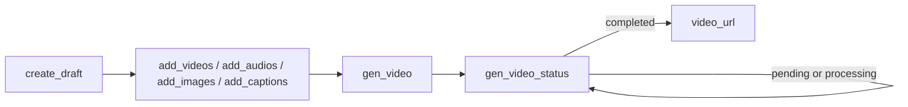

# 模型调用指南

## 🌐 语言切换
[中文版](/guide/llm-guide.zh) | [English](/guide/llm-guide)

面向大模型 / Agent 的调用说明。人类完整接口文档见侧栏；本页只写自动调用必须遵守的规则。

## 硬规则

1. **Base URL** 必须是 `https://capcut-mate.jcaigc.cn`，路径前缀 `/openapi/capcut-mate/v1/`。
2. **时间单位是微秒**：1 秒 = `1000000`。例如 5 秒片段写 `start: 0, end: 5000000`。
3. **先 `create_draft`，后续每次写接口带上返回的 `draft_url`**。不要自己编 `draft_id`。
4. **列表字段是 JSON 字符串**，不是对象数组：`video_infos`、`audio_infos`、`image_infos`、`captions`、`keyframes`、`effect_infos`、`filter_infos`。
5. 仅 `gen_video` 收费，需要 `apiKey`（UUID）。其余接口免费。
6. 导出是异步：`gen_video` 只表示任务已提交，必须轮询 `gen_video_status`。

## 默认工作流

1. `POST /create_draft` → 拿到 `draft_url`
2. 按需要多次调用 `add_videos` / `add_images` / `add_audios` / `add_captions`
3. 可选：`add_effects` / `add_filters` / `add_keyframes` / `add_masks`
4. `POST /gen_video`（线上导出带 `apiKey`）
5. 每 3–5 秒 `POST /gen_video_status`，直到 `status` 为 `completed` 或 `failed`
6. 成功后使用响应里的 `video_url`



## 不要主动调用

以下接口是给扣子 / n8n 拼 JSON 字符串用的，原生 function calling **不要**调用：

- `timelines`、`audio_timelines`
- `video_infos`、`audio_infos`、`imgs_infos`、`caption_infos`、`effect_infos`、`filter_infos`、`keyframes_infos`
- `str_to_list`、`str_list_to_objs`、`objs_to_str_list`

直接构造 JSON 字符串传给 `add_*` 即可。

## 最小示例：竖屏短视频

```bash
# 1. 创建 1080x1920 草稿
curl -X POST https://capcut-mate.jcaigc.cn/openapi/capcut-mate/v1/create_draft \
  -H "Content-Type: application/json" \
  -d '{"width":1080,"height":1920}'

# 2. 添加 5 秒视频（把 YOUR_DRAFT_URL 换成上一步的 draft_url）
curl -X POST https://capcut-mate.jcaigc.cn/openapi/capcut-mate/v1/add_videos \
  -H "Content-Type: application/json" \
  -d '{
    "draft_url": "YOUR_DRAFT_URL",
    "video_infos": "[{\"video_url\":\"https://example.com/clip.mp4\",\"start\":0,\"end\":5000000}]"
  }'

# 3. 提交导出
curl -X POST https://capcut-mate.jcaigc.cn/openapi/capcut-mate/v1/gen_video \
  -H "Content-Type: application/json" \
  -d '{"draft_url":"YOUR_DRAFT_URL","apiKey":"YOUR_UUID_API_KEY"}'

# 4. 查询状态，直到 completed
curl -X POST https://capcut-mate.jcaigc.cn/openapi/capcut-mate/v1/gen_video_status \
  -H "Content-Type: application/json" \
  -d '{"draft_url":"YOUR_DRAFT_URL"}'
```

## 状态机

| status | 含义 | 下一步 |
|--------|------|--------|
| pending | 排队中 | 继续轮询 |
| processing | 渲染中 | 继续轮询 |
| completed | 成功 | 读取 `video_url` |
| failed | 失败 | 读取 `error_message`，不要死循环 |

## 相关文档

- [精简契约](/guide/llm-contract.zh)
- [发现入口 llms.txt](/llms.txt)
- [创建草稿](/docs/create_draft.zh)
- [生成视频](/docs/gen_video.zh)
- [查询导出状态](/docs/gen_video_status.zh)
